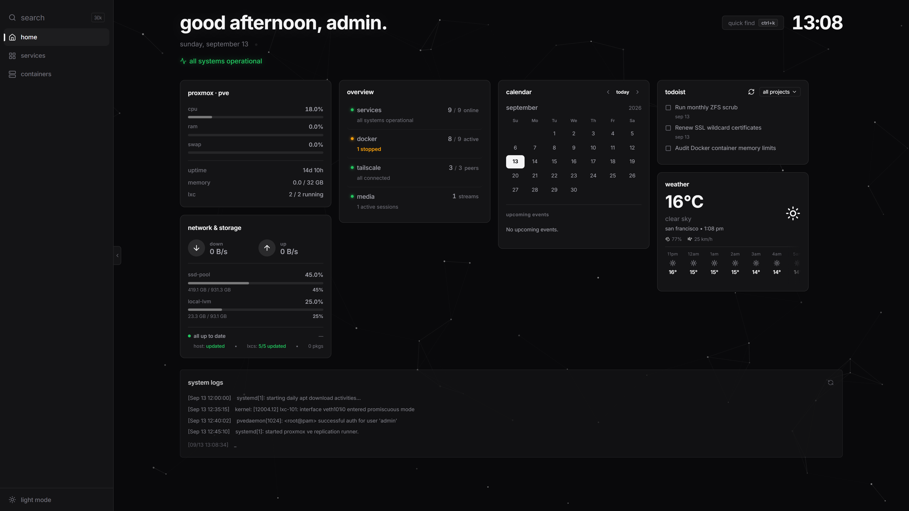
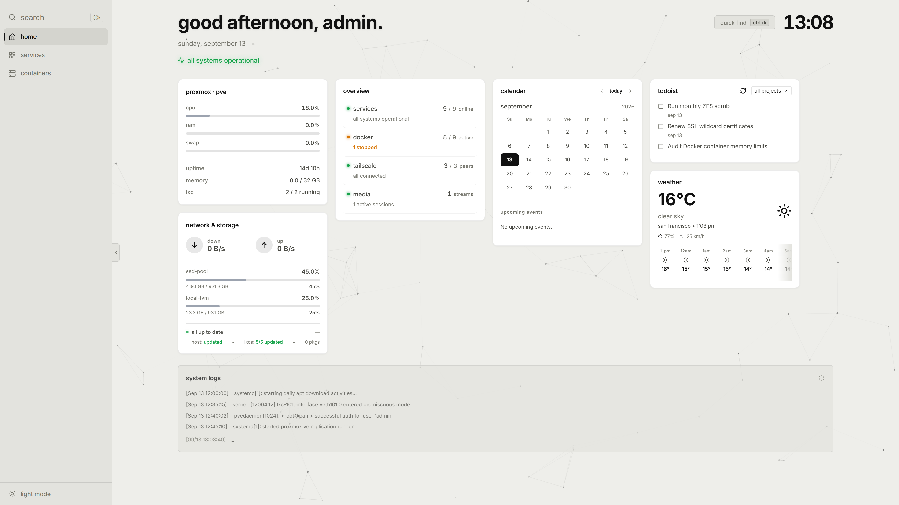
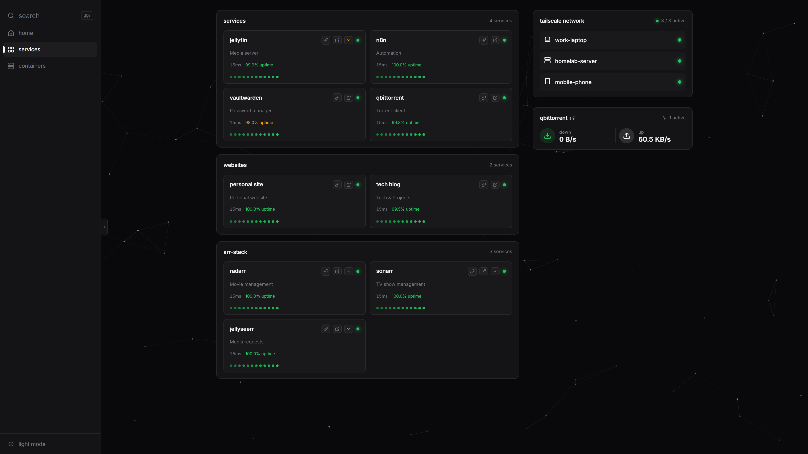
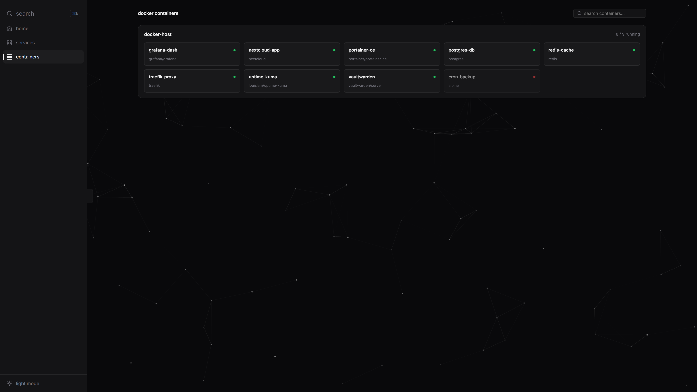

# Homelab Dashboard

A sleek, responsive, personal homelab dashboard built with **React + Vite** following the **12-Factor App / API Gateway Pattern**. Features live widgets for Proxmox VE, Portainer, Uptime Kuma, Jellyfin, Tailscale, qBittorrent, Sonarr, Radarr, Jellyseerr, Weather, Todoist, and System Updates.

## Previews

<div align="center">
  
  <br>
  <p><em>Dashboard Overview - Dark Mode</em></p>
  <br>
  
  <br>
  <p><em>Dashboard Overview - Light Mode</em></p>
  <br>
  
  <br>
  <p><em>Services Directory</em></p>
  <br>
  
  <br>
  <p><em>Docker Containers Overview</em></p>
</div>

## Architecture: 12-Factor API Gateway Pattern

The frontend is completely decoupled from your home network topology:
- **Frontend Blindness**: All browser HTTP and WebSocket requests hit relative paths (e.g. `/api/proxmox/`, `/api/portainer/`, `/api/uptime/`).
- **Dynamic Gateway**: In development, Vite's dev server proxies these paths. In production, an Nginx container handles routing using `envsubst` to dynamically populate backend URLs from environment variables at startup.
- **Portability**: No IP addresses or hostnames are hardcoded into the frontend bundle or Nginx configuration.

---

## Quick Start & Installation

### 1. Clone the repository
```bash
git clone https://github.com/your-username/pve-dashboard.git
cd pve-dashboard
```

### 2. Configure Environment Variables
Copy `.env.example` to `.env.local`:
```bash
cp .env.example .env.local
```
Edit `.env.local` to fill in:
- **Backend Routing Targets**: Your specific homelab backend URLs (e.g., `PROXMOX_BACKEND_URL`, `PORTAINER_BACKEND_URL`, `JELLYFIN_BACKEND_URL`).
- **Frontend Secrets & Config**: Your API keys and tokens (e.g., `VITE_PROXMOX_SECRET`, `VITE_PORTAINER_API_KEY`).

### 3. Configure Dashboard Services
Copy `src/config/services.example.json` to `src/config/services.json`:
```bash
cp src/config/services.example.json src/config/services.json
```
Customize `src/config/services.json` with your personal homelab services, icons, categories, and direct links. (This file is gitignored to protect your local network setup).

### 4. Run Locally (Development)
```bash
npm install
npm run dev
```
Open [http://localhost:5173](http://localhost:5173) in your browser.

### 5. Run with Docker Compose (Production)
```bash
docker compose up -d --build
```
Access the dashboard on port `80` (e.g., [http://localhost](http://localhost) or your host IP).

---

## Security
- All sensitive tokens and internal routing IPs are kept in `.env.local` and `services.json`, which are excluded via `.gitignore`.
- Variables without `VITE_` prefix remain server-side only and are never exposed in the client-side JavaScript bundle.
